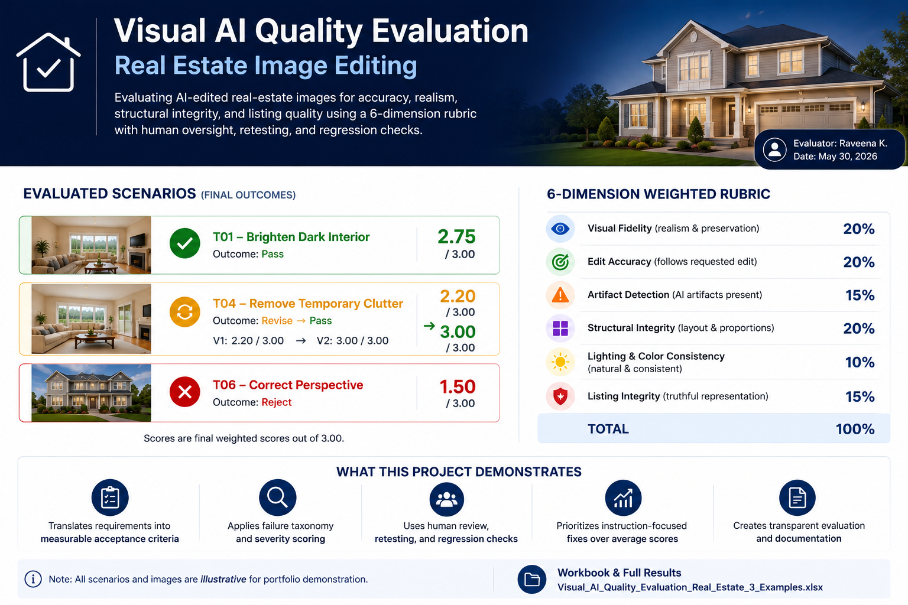

# # Visual AI Quality Evaluation — Real Estate Image Editing

A hands-on visual AI quality-evaluation project focused on assessing AI-edited real-estate images for accuracy, realism, structural integrity, listing integrity, and visual defects.

!

## Project Overview

I built a visual AI evaluation framework for real-estate image editing to demonstrate how product-quality criteria can be translated into measurable acceptance standards.

The project evaluates AI-edited property images using a structured rubric, failure taxonomy, severity levels, human-review decisions, retesting, and regression checks.

## What I Built

- Six-dimension visual AI quality rubric
- Weighted 0–3 scoring system
- Real-estate-specific acceptance criteria
- Visual failure taxonomy
- Severity classifications
- Human review decisions
- Retest and regression workflow
- 10 standardized image-editing test scenarios
- Three fully evaluated examples showing Pass, Revise/Retest, and Reject outcomes

## Evaluation Dimensions

Each AI-edited image is evaluated across:

- **Visual Fidelity** — Does the edited image still faithfully represent the original scene?
- **Edit Accuracy** — Did the AI perform the requested edit correctly?
- **Artifact Detection** — Did the edit introduce halos, blur, smearing, strange textures, or other visual defects?
- **Structural Integrity** — Were walls, windows, doors, furniture geometry, and property proportions preserved?
- **Lighting & Color Consistency** — Does the edited image still look natural and realistic?
- **Listing Integrity** — Could the edit materially misrepresent the property to a buyer?

## Failure Taxonomy

The framework classifies recurring visual AI failures using standardized codes:

- **V01 — Hallucinated Object**
- **V02 — Object Removal**
- **V03 — Geometry Distortion**
- **V04 — Structural Misrepresentation**
- **V05 — Lighting Artifact**
- **V06 — Color Drift**
- **V07 — Texture Artifact**
- **V08 — Requested Edit Failure**
- **V09 — Over-Editing**
- **V10 — Regression**

## Evaluation Outcomes

### T01 — Brighten Dark Interior

**Result:** Pass  
**Weighted Score:** 2.75 / 3.00

The AI successfully increased brightness while preserving the room layout and property details. Minor texture/smoothing artifacts were present but did not materially affect listing integrity.

### T04 — Remove Temporary Clutter

**V1 Result:** Revise  
**Weighted Score:** 2.20 / 3.00  
**Failure Codes:** V09 Over-Editing, V02 Object Removal, V07 Texture Artifact

The requested clutter was removed, but the model changed additional visual details beyond the requested scope.

A targeted revision was requested.

**V2 Retest:** 3.00 / 3.00 — Pass

The revised output removed only the temporary clutter while preserving the original furniture, decor, geometry, lighting, and property details.

### T06 — Correct Perspective

**Result:** Reject  
**Weighted Score:** 1.50 / 3.00  
**Failure Codes:** V03 Geometry Distortion, V04 Structural Misrepresentation  
**Severity:** High

The perspective correction altered the apparent geometry and proportions of the property enough that the image could misrepresent the listing.

## Human Review Logic

Each evaluated output receives one of four human decisions:

- **Pass** — output meets quality requirements
- **Revise** — output is usable after correction
- **Reject** — output should not ship
- **Escalate** — requires additional human review

## Why This Matters

AI-generated or AI-edited images can look visually impressive while still introducing subtle inaccuracies.

For real-estate use cases, visual quality is not only about aesthetics. The output must also preserve:

- true property geometry
- permanent property features
- realistic lighting and color
- accurate visual context
- truthful representation of the listing

This framework demonstrates how visual AI quality can be evaluated systematically rather than subjectively.

## Tools

- Microsoft Excel
- Structured evaluation rubrics
- Human-in-the-loop review
- Visual failure analysis
- Retesting
- Regression validation
- Adobe Lightroom / visual-media workflow experience

## Skills Demonstrated

Visual AI Evaluation, AI Quality Assurance, Acceptance Criteria, Failure Analysis, Visual Media Workflows, Human-in-the-Loop Review, Regression Testing, Quality Control, Risk Classification, Product Quality, Requirements Translation

## Project Context

This is an independent portfolio project created to demonstrate visual AI quality-evaluation methods for real-estate image editing. The images and scenarios are illustrative and are not associated with a real property listing or production deployment.
